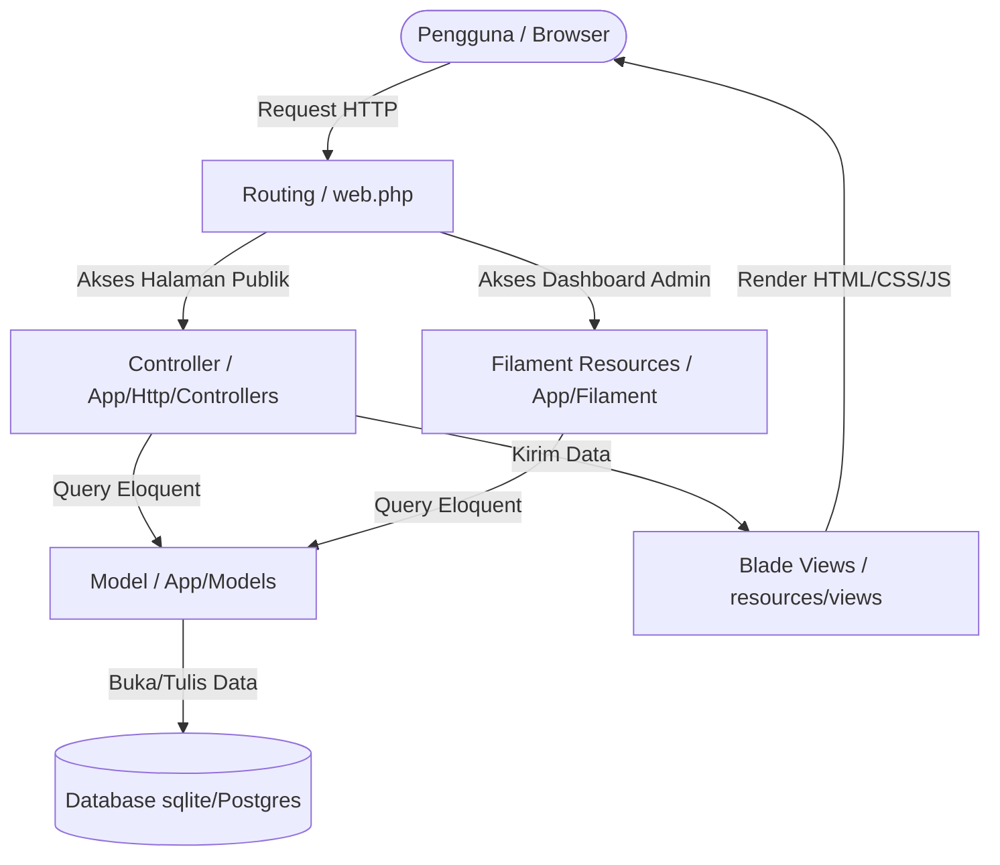
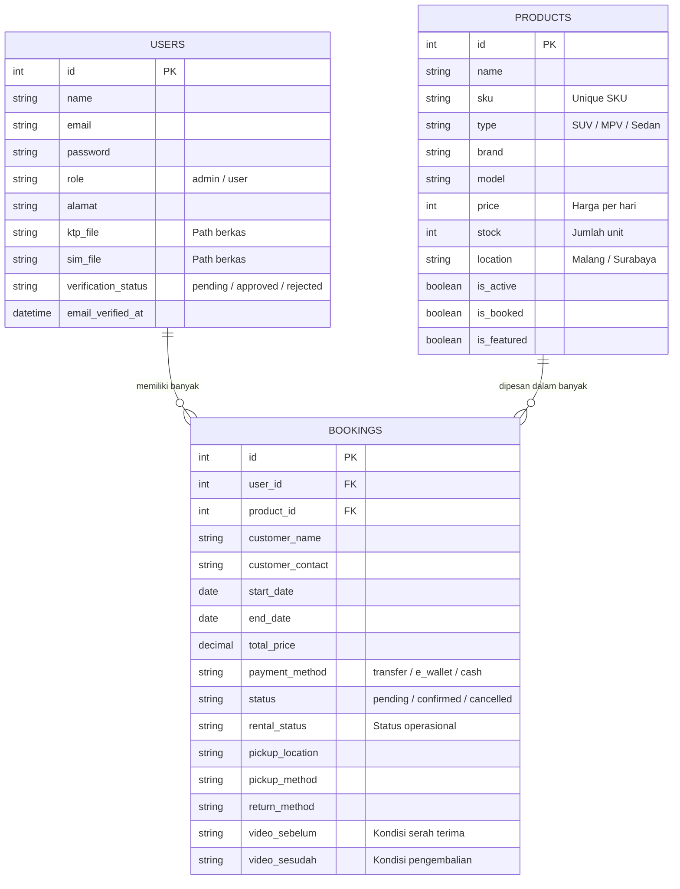

# DOKUMENTASI SISTEM - ADAM RENTAL

Dokumen ini berisi penjelasan detail mengenai arsitektur sistem, skema database, relasi antar-tabel, serta rincian kode program untuk modul-modul penting pada aplikasi **Adam Rental**. Dokumen ini dibuat rapi dan terstruktur untuk mempermudah dosen penguji PBL atau tim pengembang memahami alur logika sistem.

---

## 1. Arsitektur Sistem

Adam Rental dibangun dengan arsitektur **MVC (Model-View-Controller)** menggunakan framework **Laravel 12.x** dan diperkuat oleh **Filament Panel (v4/v5)** sebagai antarmuka panel administrasi (backoffice).



### Tumpukan Teknologi (Technology Stack)
* **Backend:** PHP 8.3 + Laravel 12.x
* **Database:** SQLite (lokal & testing) / PostgreSQL (produksi)
* **Frontend Admin:** Filament Panel (Tailwind CSS, Alpine.js, Livewire)
* **Frontend User:** Bootstrap 5.3 + Blade Template Engine + Flatpickr (Kalender Interaktif)

---

## 2. Skema & Relasi Database

Aplikasi ini memiliki 3 tabel utama yang saling berelasi:
1. `users` (Pengguna & Pelanggan)
2. `products` (Mobil / Unit Sewa)
3. `bookings` (Transaksi Penyewaan)

### Diagram Relasi Entitas (ERD)



---

## 3. Penjelasan Logika & Kode Program Utama

### A. Autentikasi dan Unggah Dokumen Verifikasi (`AuthController.php`)
Setiap pelanggan baru wajib mengunggah foto KTP dan SIM saat registrasi. Akun mereka akan berstatus `pending` dan dialihkan ke halaman verifikasi sampai Admin menyetujui dokumen tersebut di panel administrasi.

* **Penjelasan Alur Kode Registrasi:**
```php
public function register(Request $request)
{
    // 1. Validasi input, pastikan dokumen KTP & SIM berupa berkas gambar maksimal 2MB
    $request->validate([
        'name' => ['required', 'string', 'max:255'],
        'email' => ['required', 'string', 'email', 'max:255', 'unique:users'],
        'alamat' => ['required', 'string'],
        'ktp_file' => ['required', 'image', 'mimes:jpeg,png,jpg', 'max:2048'],
        'sim_file' => ['required', 'image', 'mimes:jpeg,png,jpg', 'max:2048'],
        'password' => ['required', 'string', 'min:8'],
    ]);

    // 2. Simpan dokumen fisik KTP & SIM ke folder private storage/app/public/profiles
    $ktpPath = $request->file('ktp_file')->store('profiles/ktp', 'public');
    $simPath = $request->file('sim_file')->store('profiles/sim', 'public');

    // 3. Buat baris baru pada tabel users dengan status verifikasi awal 'pending'
    $user = User::create([
        'name' => $request->name,
        'email' => $request->email,
        'password' => $request->password, // Otomatis ter-hash oleh Laravel Casts
        'role' => 'user',
        'alamat' => $request->alamat,
        'ktp_file' => $ktpPath,
        'sim_file' => $simPath,
        'verification_status' => 'pending',
    ]);

    // 4. Autentikasi instan ke session login aplikasi
    Auth::login($user);

    // 5. Alihkan ke halaman notifikasi verifikasi email/dokumen
    return redirect('/email/verify')->with('success', 'Registrasi sukses! Akun Anda sedang dalam proses peninjauan oleh Admin.');
}
```

---

### B. Pencarian Global Cerdas (`GlobalSearchController.php`)
Fitur ini mencakup pencarian cerdas yang tidak hanya mencari data mobil di database, melainkan juga mencari rute halaman web (seperti riwayat transaksi atau profil) serta topik bantuan umum (FAQ).

* **Penjelasan Logika Pencarian:**
```php
public function search(Request $request)
{
    $keyword = $request->input('q');

    // Deteksi driver database untuk kecocokan tipe query (menggunakan ILIKE untuk PostgreSQL agar case-insensitive)
    $operator = (new Product)->getConnection()->getDriverName() === 'pgsql' ? 'ILIKE' : 'LIKE';

    // 1. Query Pencarian Unit Mobil
    $products = Product::where('is_active', 1)
        ->where(function($query) use ($keyword, $operator) {
            $query->where('name', $operator, "%{$keyword}%")
                ->orWhere('brand', $operator, "%{$keyword}%")
                ->orWhere('location', $operator, "%{$keyword}%")
                ->orWhere('type', $operator, "%{$keyword}%");
            
            // Cegah error casting PostgreSQL dengan memastikan keyword berupa angka sebelum mencocokkan kapasitas
            if (is_numeric($keyword)) {
                $query->orWhere('capacity', (int)$keyword)
                      ->orWhere('price', '<=', (int)$keyword);
            }
        })
        ->get();

    // 2. Kamus Pencarian Elemen Website (Static Pages)
    $websiteElements = [
        [
            'title' => 'Katalog Produk (Sewa)',
            'description' => 'Lihat daftar mobil/produk yang tersedia untuk disewa dan lakukan filter.',
            'url' => url('/product'),
            'icon' => 'bi-car-front',
            'keywords' => ['product', 'produk', 'katalog', 'daftar', 'mobil', 'sewa']
        ],
        // ... (data halaman lainnya)
    ];

    // Filter elemen website berdasarkan kecocokan keyword terhadap judul, deskripsi, atau keywords tag
    $matchedElements = [];
    if (!empty($keyword)) {
        foreach ($websiteElements as $element) {
            $matches = false;
            if (stripos($element['title'], $keyword) !== false || stripos($element['description'], $keyword) !== false) {
                $matches = true;
            } else {
                foreach ($element['keywords'] as $kw) {
                    if (stripos($kw, $keyword) !== false) { $matches = true; break; }
                }
            }
            if ($matches) { $matchedElements[] = $element; }
        }
    }

    return view('search.results', compact('products', 'keyword', 'matchedElements'));
}
```

---

### C. Alur Filter Tanggal Tabrakan/Ketersediaan Mobil (`ProductController.php`)
Untuk menghindari *double-booking* mobil pada tanggal yang sama, sistem melakukan pencarian overlap tanggal.

* **Penjelasan Logika Anti-Tabrakan:**
```php
if ($request->filled(['start_date', 'end_date'])) {
    $start = $request->start_date;
    $end = $request->end_date;

    // Filter keluar mobil yang sudah memiliki booking terkonfirmasi (status = confirmed) di rentang tanggal tersebut
    $query->whereDoesntHave('bookings', function ($q) use ($start, $end) {
        $q->where('status', 'confirmed')
            ->where(function ($q) use ($start, $end) {
                // Kondisi Overlap Tanggal:
                // 1. Tanggal mulai sewa baru berada di antara transaksi sewa lama
                $q->whereBetween('start_date', [$start, $end])
                // 2. Tanggal selesai sewa baru berada di antara transaksi sewa lama
                  ->orWhereBetween('end_date', [$start, $end])
                // 3. Sewa baru mencakup seluruh durasi sewa lama
                  ->orWhere(function ($sub) use ($start, $end) {
                      $sub->where('start_date', '<=', $start)
                          ->where('end_date', '>=', $end);
                  });
            });
    });
}
```

---

### D. Otomatisasi Status Keaktifan Mobil (`Booking.php` Model Hook)
Untuk mempermudah monitoring, jika status sewa mobil dalam transaksi adalah `Telah Dikonfirmasi` atau `Pengembalian Dalam Proses`, status unit mobil (`is_booked`) akan otomatis bernilai `true` (Disewa), sehingga unit tidak muncul di halaman katalog depan.

* **Kode Hook Eloquent Model:**
```php
protected static function booted()
{
    // Terpicu secara otomatis saat data Booking disimpan (create/update)
    static::saved(function ($booking) {
        self::updateProductStatus($booking->product);
    });

    // Terpicu secara otomatis saat data Booking dihapus
    static::deleted(function ($booking) {
        self::updateProductStatus($booking->product);
    });
}

private static function updateProductStatus($product)
{
    if ($product) {
        // Cek apakah mobil sedang dalam masa sewa aktif saat ini
        $isCurrentlyBooked = $product->bookings()
            ->whereIn('rental_status', ['Telah Dikonfirmasi', 'Pengembalian Dalam Proses'])
            ->whereDate('start_date', '<=', now())
            ->whereDate('end_date', '>=', now())
            ->exists();

        // Update kolom is_booked pada tabel products
        $product->update([
            'is_booked' => $isCurrentlyBooked
        ]);
    }
}
```

---

### E. Perhitungan Otomatis Total Harga di Panel Admin (`BookingResource.php`)
Di panel admin Filament, saat Admin membuat booking secara manual, kolom total harga akan otomatis terhitung ketika Admin memilih tipe mobil dan memasukkan rentang tanggal sewa.

```php
protected static function updateTotalPrice(Get $get, Set $set): void
{
    $productId = $get('product_id');
    $startDate = $get('start_date');
    $endDate = $get('end_date');

    if ($productId && $startDate && $endDate) {
        $product = Product::find($productId);
        
        if ($product) {
            $start = Carbon::parse($startDate);
            $end = Carbon::parse($endDate);

            // Validasi: Jika tanggal selesai sebelum tanggal mulai, set 0
            if ($end->lessThan($start)) {
                $set('total_price', 0);
                return;
            }

            // Hitung selisih hari
            $duration = $start->diffInDays($end);
            if ($duration == 0) { $duration = 1; }

            // Set nilai ke input field total_price secara real-time
            $totalPrice = $product->price * $duration;
            $set('total_price', $totalPrice);
        }
    }
}
```

---

## 4. Struktur Database Lengkap (Reference Table)

### Tabel `users`
| Nama Kolom | Tipe Data | Keterangan |
| :--- | :--- | :--- |
| `id` | BigInt (PK) | Auto increment primary key |
| `name` | String | Nama lengkap pengguna |
| `email` | String (Unique) | Alamat email unik |
| `password` | String | Kata sandi terenkripsi |
| `role` | String | Peran akun (`admin` / `user`) |
| `photo` | String (Nullable) | Path foto profil |
| `bio` | Text (Nullable) | Deskripsi singkat pengguna |
| `alamat` | Text | Alamat domisili lengkap |
| `ktp_file` | String | Path foto KTP di disk penyimpanan |
| `sim_file` | String | Path foto SIM A di disk penyimpanan |
| `verification_status`| String | Status verifikasi (`pending`, `approved`, `rejected`) |
| `email_verified_at` | DateTime (Nullable) | Tanggal persetujuan verifikasi akun oleh admin |

### Tabel `products`
| Nama Kolom | Tipe Data | Keterangan |
| :--- | :--- | :--- |
| `id` | BigInt (PK) | Auto increment primary key |
| `name` | String | Nama/Model mobil (misal: Avanza Veloz) |
| `sku` | String (Unique) | Kode unik stok mobil |
| `type` | String | Tipe mobil (`SUV`, `MPV`, `Sedan`) |
| `brand` | String | Merk mobil (Toyota, Honda, dll) |
| `price` | Integer | Harga sewa per 24 jam (Rupiah) |
| `stock` | Integer | Jumlah unit tersedia |
| `location` | String | Lokasi garasi (`Malang` / `Surabaya`) |
| `description` | Text | Deskripsi unit |
| `image` | String (Nullable) | Gambar utama mobil |
| `images` | Text (JSON Array) | Galeri detail foto mobil |
| `tahun` | Integer | Tahun produksi kendaraan |
| `warna` | String | Warna kendaraan |
| `plat_nomor` | String | Nomor polisi kendaraan |
| `kapasitas_mesin` | Integer | CC Mesin kendaraan |
| `fitur` | Text (JSON Array) | Fitur (misal: AC, Audio, Sunroof) |
| `kondisi` | Text | Kondisi fisik saat ini |
| `is_active` | Boolean | Apakah unit aktif direntalkan |
| `is_booked` | Boolean | Apakah unit sedang tersewa |
| `is_featured` | Boolean | Ditampilkan sebagai produk teratas |

### Tabel `bookings`
| Nama Kolom | Tipe Data | Keterangan |
| :--- | :--- | :--- |
| `id` | BigInt (PK) | Auto increment primary key |
| `user_id` | BigInt (FK) | Relasi ke tabel `users` |
| `product_id` | BigInt (FK) | Relasi ke tabel `products` |
| `customer_name` | String | Nama penyewa |
| `customer_contact` | String | No. HP / WhatsApp penyewa |
| `start_date` | Date | Tanggal serah terima unit |
| `end_date` | Date | Tanggal pengembalian unit |
| `total_price` | Decimal | Total tagihan |
| `payment_method` | String | Metode pembayaran (`transfer`, `e_wallet`, `cash`) |
| `status` | String | Status pembayaran (`pending`, `confirmed`, `cancelled`) |
| `rental_status` | String | Status operasional rental |
| `pickup_location` | String | Alamat pengambilan mobil |
| `pickup_method` | String | Metode pengambilan unit |
| `return_method` | String | Metode pengembalian unit |
| `video_sebelum` | String (Nullable) | Path video bukti serah terima awal |
| `video_sesudah` | String (Nullable) | Path video bukti pengembalian unit |
